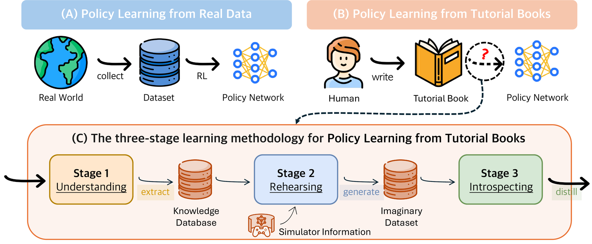
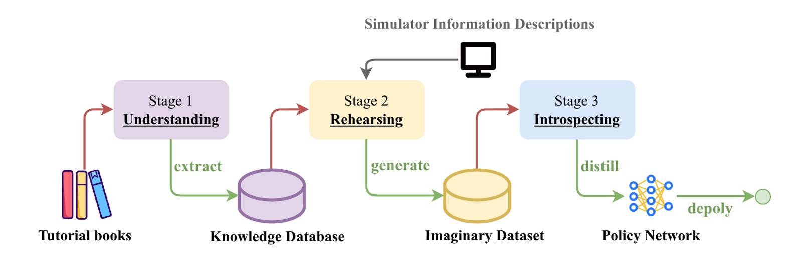

# Policy Learning from Books

<p align="center">
  <strong>Policy Learning from Tutorial Books via Understanding, Rehearsing and Introspecting</strong><br>
  NeurIPS 2024 Oral
</p>

<p align="center">
  <a href="https://proceedings.neurips.cc/paper_files/paper/2024/hash/21cf8411ed825614e00006a1d9aab7e4-Abstract-Conference.html">NeurIPS Paper</a> |
  <a href="https://proceedings.neurips.cc/paper_files/paper/2024/file/21cf8411ed825614e00006a1d9aab7e4-Paper-Conference.pdf">PDF</a> |
  <a href="https://openreview.net/forum?id=Ddak3nSqQM">OpenReview</a> |
  <a href="https://plfb-football.github.io/">Project Page</a> |
  <a href="https://github.com/ziyan-wang98/URI_video_NeurIPS">Videos</a> |
  <a href="https://huggingface.co/datasets/ziyan98/plfb">Hugging Face Artifacts</a>
</p>

<p align="center">
  
</p>

PLfB asks whether a policy network can be learned from tutorial books instead of large real-interaction datasets. URI is a three-stage implementation: it extracts task knowledge from books, rehearses imagined trajectories from that knowledge, and introspects on the imagined dataset to train an uncertainty-aware CIQL policy.

<p align="center">
  
</p>

## Demo

<p align="center">
  
  
</p>

<p align="center"><em>Left: baseline agent. Right: PLfB/URI policy. Full clips: <a href="docs/assets/baseline_fb1.mp4">baseline</a> and <a href="docs/assets/plfb_fb2.mp4">PLfB/URI</a>.</em></p>

## What Is Released

| Component | Location | Notes |
| --- | --- | --- |
| Code | this repository | Public wrappers for environment checks, artifact download, stage smoke tests, CIQL training, and evaluation. |
| Data and models | <a href="https://huggingface.co/datasets/ziyan98/plfb">ziyan98/plfb</a> | Stage-organized public artifacts, final model, imagined dataset cache, first-stage uncertainty checkpoint, manifests, and reports. |
| Paper demos | <a href="https://github.com/ziyan-wang98/URI_video_NeurIPS">URI_video_NeurIPS</a> | Gameplay videos for URI and LLM-RAG in Google Research Football. |
| Project page | <a href="https://plfb-football.github.io/">plfb-football.github.io</a> | Paper links, oral/poster/video links, method summary, and result tables. |

The release is built around reproducibility: users can download the public Hugging Face artifacts, validate the artifact layout, evaluate the released final policy, and rerun the public CIQL replay path from the retained 2024-02 imagined dataset cache.

## Quickstart

```bash
git clone https://github.com/ziyan-wang98/Policy-Learning-From-Books.git
cd Policy-Learning-From-Books

micromamba create -y -n plfb-universal -f environment-universal.yml
micromamba activate plfb-universal
python -m pip install --no-deps -e football_llm/d3rlpy
python -m pip install -e football_llm/setup/football
export PYTHONPATH="$PWD/football_llm:$PWD/football_llm/d3rlpy:$PWD/football_llm/setup/football:$PWD/plfb-uri:$PYTHONPATH"

python scripts/check_environment.py --quick --strict-football
export PLFB_ARTIFACT_ROOT=$PWD/plfb_artifacts
bash scripts/download_artifacts.sh
python scripts/check_environment.py --check-artifacts --artifact-root "$PLFB_ARTIFACT_ROOT"
bash scripts/smoke_stage.sh all
bash scripts/eval_ciql.sh --dry-run
bash scripts/eval_ciql.sh
```

Use `mamba` if that is your available solver. Conda classic can also work, but the football/GFootball stack uses conda-forge native packages and may require more solver memory and time.

## Hugging Face Artifacts

All public data/model artifacts are hosted at <a href="https://huggingface.co/datasets/ziyan98/plfb">huggingface.co/datasets/ziyan98/plfb</a>. The dataset is organized by pipeline stage and includes `manifests/stage_file_map_20260613.json`, which maps each uploaded file to its stage and role.

Install the Hugging Face CLI and download the full public artifact tree:

```bash
python -m pip install "huggingface_hub[hf_transfer]"
export HF_HUB_ENABLE_HF_TRANSFER=1
export PLFB_HF_REPO=ziyan98/plfb
export PLFB_ARTIFACT_ROOT=$PWD/plfb_artifacts
hf download "$PLFB_HF_REPO" --repo-type dataset --local-dir "$PLFB_ARTIFACT_ROOT"
```

Or use the repository helper, which also validates the artifact layout:

```bash
export PLFB_ARTIFACT_ROOT=$PWD/plfb_artifacts
bash scripts/download_artifacts.sh --repo ziyan98/plfb --local-dir "$PLFB_ARTIFACT_ROOT"
```

Release-critical artifacts:

| Role | Hugging Face path |
| --- | --- |
| Final CIQL policy | `artifacts/football/final_uri_best/model_rew_0.5&step_48000.d3` |
| Final CIQL params | `artifacts/football/final_uri_best/params.json` |
| 2024-02 imagined merged cache | `football/imaginary_dataset_0204/merged_data/v3datatrace_real_num=0&extra_real_traj_num=0&obs_stack_num=4&rollout_num=0.npz` |
| Public first-stage uncertainty checkpoint | `artifacts/football/strict_repro_first_stage_ba0e02e/model_290000.d3` |

The wrappers default to this layout once `PLFB_ARTIFACT_ROOT` is set:

```bash
export PLFB_ARTIFACT_ROOT=$PWD/plfb_artifacts
export PLFB_WORK_ROOT=$PWD/runs
bash scripts/train_ciql.sh --dry-run
bash scripts/train_ciql.sh
```

Raw book text, provider credentials, historical BC policy checkpoints, unselected intermediate checkpoints, old staging datasets, and auxiliary experiments are not distributed.

## Pipeline

<p align="center">
  
</p>

| Stage | Command | Needs API key | Needs GPU | Output |
| --- | --- | --- | --- | --- |
| Environment and artifacts | `python scripts/check_environment.py`; `bash scripts/smoke_stage.sh 0` | No | No | install and artifact validation |
| Book understanding | `bash scripts/book_understanding.sh` | Yes | No | book-derived knowledge artifacts |
| Retrieval/context | `bash scripts/prepare_retrieval_context.sh` | No for retained artifacts | No | retrieval JSONL/context files |
| Imagined trajectories | `bash scripts/generate_imagined_trajectories.sh` | Yes for regeneration | Optional | imagined trajectory shards |
| Uncertainty model | `bash scripts/introspect_uncertainty.sh` | No | Yes for training | first-stage uncertainty checkpoint |
| CIQL training | `bash scripts/train_ciql.sh` | No | Yes | CIQL policy checkpoints |
| Final evaluation | `bash scripts/eval_ciql.sh` | No | Yes for practical speed | eval JSON |

See `docs/architecture.md`, `docs/reproduction.md`, and `docs/pipeline_modules.md` for the full file-level map.

## Evaluate the Released Policy

The released football policy is `artifacts/football/final_uri_best/model_rew_0.5&step_48000.d3`. After downloading the Hugging Face artifacts, run:

```bash
export PLFB_ARTIFACT_ROOT=$PWD/plfb_artifacts
export PLFB_WORK_ROOT=$PWD/runs
bash scripts/eval_ciql.sh --dry-run
bash scripts/eval_ciql.sh
```

The evaluation wrapper loads the released checkpoint from `PLFB_ARTIFACT_ROOT` and writes evaluation logs under `PLFB_WORK_ROOT/eval_result`.

## Optional LLM-backed Regeneration

LLM stages are optional for final evaluation and no-API CIQL replay. For new data-generation experiments:

```bash
export PLFB_BOOK_JSONL=/path/to/book_subset.jsonl
export OPENAI_API_KEY=...
export PLFB_OPENAI_CHAT_MODEL=gpt-4o-mini
export PLFB_OPENAI_EMBEDDING_MODEL=text-embedding-3-small
export PLFB_USE_OPENAI_COMPAT_CLIENT=1
bash scripts/book_understanding.sh
bash scripts/prepare_retrieval_context.sh
bash scripts/generate_imagined_trajectories.sh
```

The OpenAI-compatible client honors `OPENAI_BASE_URL`, so newer OpenAI models or compatible providers can be used for new experiments. Do not commit API keys, private endpoints, generated logs, `.d3` checkpoints, or `.npz` artifacts to Git.

## Repository Layout

| Path | Purpose |
| --- | --- |
| `football_llm/` | Football implementation, LLM generation, retrieval, CIQL training/eval, vendored d3rlpy, and bundled GFootball source. |
| `plfb-uri/` | URI-style understanding and introspection entry points. |
| `scripts/` | Stable public wrappers, smoke checks, environment checks, and run summarization. |
| `examples/slurm/` | Generic scheduler templates. Edit resource and activation lines for your environment. |
| `docs/` | Architecture, reproduction, data contract, traceability, and troubleshooting. |
| `environment-universal.yml` | Recommended full public runtime. |
| `environment.yml` | Lightweight book/data environment when football runtime is not needed. |
| `environment-gfootball.yml` | Football-only runtime reference. |
| `environment-hf-upload.yml` | Artifact upload tooling only; not needed for reproduction. |

## Documentation

- `docs/architecture.md`: stage architecture and repo map.
- `docs/reproduction.md`: end-to-end install, artifact validation, final eval, and CIQL replay.
- `docs/command_reference.md`: command snippets and useful overrides.
- `docs/data_release.md` and `docs/dataset_contract.md`: artifact layout and release contract.
- `docs/final_ciql_model.md` and `docs/paper_traceability.md`: final model, metrics, and limitations.
- `docs/troubleshooting.md`: common setup/runtime issues.

## Citation

If you use this code or dataset, please cite:

```bibtex
@inproceedings{chen2024plfb,
  title = {Policy Learning from Tutorial Books via Understanding, Rehearsing and Introspecting},
  author = {Chen, Xiong-Hui and Wang, Ziyan and Du, Yali and Jiang, Shengyi and Fang, Meng and Yu, Yang and Wang, Jun},
  booktitle = {Advances in Neural Information Processing Systems},
  volume = {37},
  pages = {18940--18987},
  year = {2024},
  url = {https://proceedings.neurips.cc/paper_files/paper/2024/file/21cf8411ed825614e00006a1d9aab7e4-Paper-Conference.pdf},
  doi = {10.52202/079017-0600}
}
```
