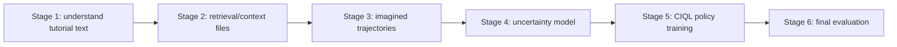

# Architecture

PLfB is organized as a release-oriented research pipeline. The public workflow separates paper-aligned artifacts from lower-level research code so users can reproduce the released result before modifying the generation stack.

## Public Entry Points

| Stage | Purpose | Main command | Public artifacts |
| --- | --- | --- | --- |
| 0 | Environment and artifact validation | `python scripts/check_environment.py --quick`; `bash scripts/smoke_stage.sh 0` | none |
| 1 | Book understanding with an LLM provider | `bash scripts/book_understanding.sh` | `book_derived/v4-gpt-3.5-turbo-1106-level-strict`, `book_derived/uri_text_results` |
| 2 | Retrieval/context validation and normalization | `bash scripts/prepare_retrieval_context.sh` | `book_derived/retrieval` |
| 3 | Imagined trajectory generation | `bash scripts/generate_imagined_trajectories.sh` | `football/generated_llm_results`, `football/imaginary_dataset_0204/no_*.npz` |
| 4 | First-stage uncertainty model | `bash scripts/introspect_uncertainty.sh --smoke` | `artifacts/football/strict_repro_first_stage_ba0e02e/model_290000.d3` |
| 5 | CIQL policy training | `bash scripts/train_ciql.sh` | trained `.d3` policies under `PLFB_WORK_ROOT` |
| 6 | Final model evaluation | `bash scripts/eval_ciql.sh` | `artifacts/football/final_uri_best/model_rew_0.5&step_48000.d3` |

## Repository Layout

| Path | Role |
| --- | --- |
| `football_llm/book_scripts/` | Tutorial text filtering and understanding utilities. |
| `football_llm/llm/` | LLM-backed trajectory generation and OpenAI-compatible client helpers. |
| `football_llm/retrieval/` | Retrieval/context code used before trajectory generation. |
| `football_llm/learning/` | First-stage uncertainty training, CIQL training, and evaluation. |
| `football_llm/d3rlpy/` | Vendored d3rlpy fork used by the historical CIQL implementation. |
| `football_llm/setup/football/` | Bundled Google Research Football source used by evaluation/training. |
| `plfb-uri/` | URI-style entry points for understanding and introspection experiments. |
| `scripts/` | Stable public wrappers and smoke checks. Use these before lower-level modules. |
| `examples/slurm/` | Generic scheduler templates. Edit partition/account/time/environment lines for your own scheduler. |
| `docs/` | Release contract, reproduction notes, stage map, and troubleshooting. |

## Reproducibility Contract

The public release supports three levels of reproducibility:

| Level | What it proves | Requires API key | Requires GPU | Status |
| --- | --- | --- | --- | --- |
| Final evaluation | The released CIQL checkpoint loads and evaluates. | No | Yes for practical speed | Supported by `scripts/eval_ciql.sh`. |
| No-API CIQL replay | CIQL can retrain from the public 2024-02 imagined dataset cache and public first-stage uncertainty checkpoint. | No | Yes | Supported by `scripts/train_ciql.sh`. |
| Full data regeneration | Book outputs and imagined trajectories can be regenerated with a current OpenAI-compatible model. | Yes | Optional until CIQL | Supported as research workflow; raw books and historical BC checkpoints are not distributed. |

The release includes the selected final CIQL checkpoint, the public imagined dataset cache, and the first-stage uncertainty checkpoint needed by the replay workflow. Reported benchmark results are documented in the paper and project page.
